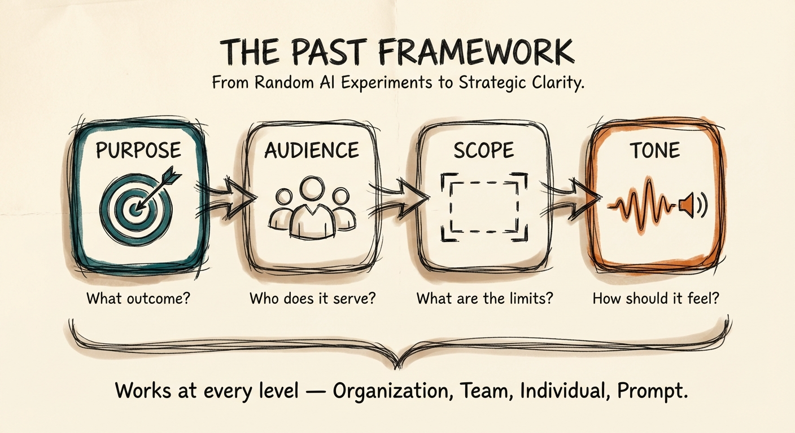

# The PAST Framework

**From Random AI Experiments to Strategic Clarity**

---

Most AI implementations fail before they start — not because of bad technology, but because of unclear strategy.

The PAST Framework is a thinking framework for AI adoption that works at every level: from organizational strategy down to individual prompt engineering. It asks four questions that determine success or failure:

- **P**urpose — What specific outcome are you trying to achieve?
- **A**udience — Who does AI serve?
- **S**cope — What are the realistic boundaries?
- **T**one — How should AI align with your culture and voice?

## Why PAST Exists

Walk into any organization today and you'll see the pattern: Marketing has their ChatGPT subscription. Sales discovered a different AI tool for lead scoring. Customer service is experimenting with chatbots. HR tests resume screening.

Each department discovered AI independently, chose different tools, measures different metrics — and none of them are talking to each other.

**The question everyone asks:** "How can we use AI?"

**The question they should ask:** "What business outcomes do we need to achieve?"

This shift — from technology-first to outcome-first thinking — is where PAST begins.

## Who This Is For

- **Business professionals** starting with AI and wanting strategic clarity before random experimentation
- **Consultants** designing AI strategies for clients who need a proven framework
- **Team leaders** defining AI direction without getting lost in tool comparisons
- **Anyone writing prompts** who wants systematically better results
- **Solopreneurs** deciding which AI tools deserve investment of time and money

## Framework at a Glance

| Element | Question | What It Prevents |
|---------|----------|------------------|
| **Purpose** | What specific outcome do we need? | Vague goals, technology-first thinking, solution-seeking-problem |
| **Audience** | Who uses this and who receives outputs? | Designing for buyers not users, ignoring resistors |
| **Scope** | What's included and what's Phase 2? | Scope creep, trying to solve everything at once |
| **Tone** | How should AI align with culture? | Generic AI slop, cultural mismatch, adoption failure |

## Multi-Level Application

The same four questions guide billion-dollar AI implementations and daily prompt writing:

- **Organizational Strategy:** Enterprise AI implementation and governance
- **Team Workflows:** Department-specific process optimization
- **Individual Productivity:** Personal workflow enhancement
- **Prompt Engineering:** Creating effective AI interactions

## Read the Full Guide

The complete field guide with worksheets, templates, examples, and enhancement checklists:

**[The PAST Framework Field Guide](field-guide.md)**

## The PAST + SHAPE Connection

**PAST tells you WHAT and WHY.** Strategic clarity about what you're trying to achieve.

**[SHAPE](https://github.com/aplaceforallmystuff/shape-framework) tells you HOW and WHEN.** Systematic execution from assessment through evaluation.

Together they form a complete system from strategy to implementation.

## Quick-Start: The Purpose Clarity Exercise

Before any AI initiative, complete this statement:

> "Success means **[specific measurable outcome]** which will **[business impact]** by **[timeline]** as measured by **[metric]**."

If any part is blank or "TBD", you're not ready to evaluate tools. Return to purpose definition.

## License

This work is licensed under a [Creative Commons Attribution-ShareAlike 4.0 International License](https://creativecommons.org/licenses/by-sa/4.0/).

You are free to:
- **Share** — copy and redistribute the material in any medium or format
- **Adapt** — remix, transform, and build upon the material for any purpose, including commercial

Under the following terms:
- **Attribution** — You must give appropriate credit, provide a link to the license, and indicate if changes were made
- **ShareAlike** — If you remix, transform, or build upon the material, you must distribute your contributions under the same license

## Author

Created by [Jim Christian](https://jimchristian.net) — AI implementation specialist, framework creator, and author of [Signal Over Noise](https://signalovernoise.at).

